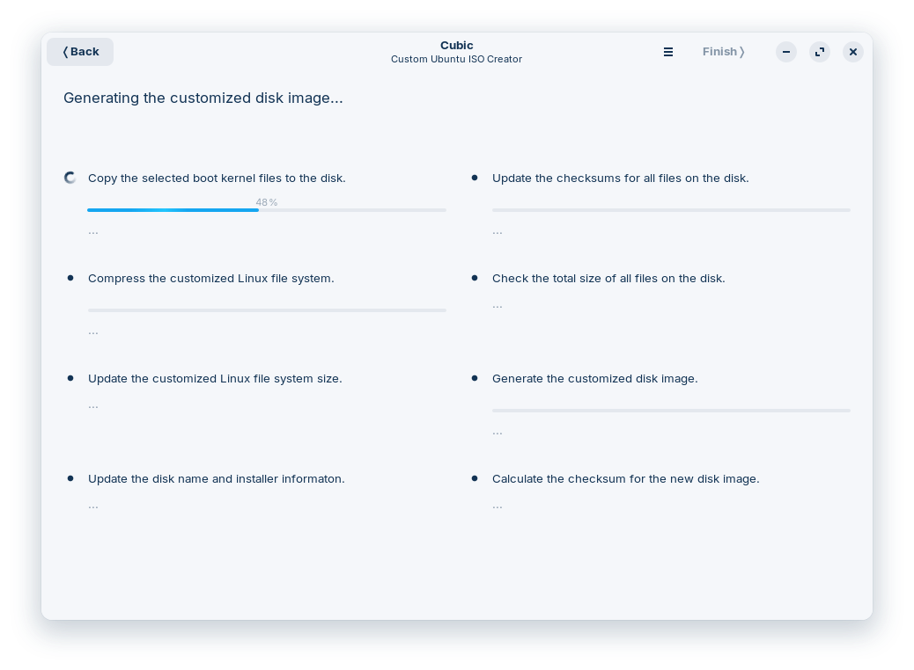

# Autoinstall Ubuntu Server 24.04

Guía para crear una imagen de instalación auto instalable de **Ubuntu Server 24.04**.

## Requisitos

- **Ubuntu Server 24.04** ([Descargar](https://www.ubuntu.com/download/server))
- **Cubic** ([Descargar](https://github.com/PJ-Singh-001/Cubic))
- **whois** ([Descargar](https://packages.ubuntu.com/noble/whois))
- **Curl** ([Descargar](https://curl.se/download.html))

---

## Descarga de archivos de configuración

Para descargar el archivo principal de autoinstalación, usa el siguiente comando:

```sh
curl -L -o user-data https://raw.githubusercontent.com/firagonb3/autoinstall-ubuntu-server-v24.04/refs/heads/main/autoinstall/autoinstall.yaml
```

Para descargar el archivo principal de autoinstalación con actualización automática, usa el siguiente comando:

```sh
curl -L -o user-data https://raw.githubusercontent.com/firagonb3/autoinstall-ubuntu-server-v24.04/refs/heads/main/autoinstall/autoinstall-upgrade.yaml
```

Ejemplos adicionales según la configuración de red:

```sh
# Configuración con DHCP activado
curl -L -o user-data https://raw.githubusercontent.com/firagonb3/autoinstall-ubuntu-server-v24.04/refs/heads/main/autoinstall/autoinstall-DHCP-on.yaml

# Configuración con DHCP desactivado (solo DHCPv4)
# requiere modificar la dirección IP de la red
curl -L -o user-data https://raw.githubusercontent.com/firagonb3/autoinstall-ubuntu-server-v24.04/refs/heads/main/autoinstall/autoinstall-DHCP-off.yaml
```

Ejemplo de configuración de red con actualización automática:

```sh
# Configuración con DHCP activado (DHCPv4 y DHCPv6)
curl -L -o user-data https://raw.githubusercontent.com/firagonb3/autoinstall-ubuntu-server-v24.04/refs/heads/main/autoinstall/autoinstall-DHCP-on-upgrade.yaml

# Configuración con DHCP desactivado (solo DHCPv4)
# requiere modificar la dirección IP de la red
curl -L -o user-data https://raw.githubusercontent.com/firagonb3/autoinstall-ubuntu-server-v24.04/refs/heads/main/autoinstall/autoinstall-DHCP-off-upgrade.yaml
```

---

## Modificación del archivo `autoinstall.yaml`

El archivo `autoinstall.yaml` puede ser modificado para personalizar la instalación según tus necesidades. Puedes consultar la documentación oficial de Canonical para más detalles sobre las opciones disponibles en la siguiente ruta:

[Referencia de Autoinstall](https://canonical-subiquity.readthedocs-hosted.com/en/latest/reference/autoinstall-reference.html)

### Cambio del nombre de usuario y contraseña

Para modificar el usuario y nombre del equipo hay que modificar los campos `hostname`, `realname` y `username` en el archivo `autoinstall.yaml`:

Para modificar la contraseña, puedes usar el siguiente comando para generar una contraseña cifrada en SHA-512:

```sh
mkpasswd -m sha-512 ubuntu

# ejemplo de resultado
$6$.EBtzSOZolqm4Gbs$27G8kdOZPps3WfrBhEbzQsOEES3PbjUDIKpbA/utynZoJ/NhlWeh3DL.XrDtmZ0t8NbLpRYBXSJJ8GcoPycvi/
```

Ejemplo de configuración en `autoinstall.yaml`:

```yaml
autoinstall:
  version: 1
  identity:
    hostname: ubuntu-server
    password: $6$.EBtzSOZolqm4Gbs$27G8kdOZPps3WfrBhEbzQsOEES3PbjUDIKpbA/utynZoJ/NhlWeh3DL.XrDtmZ0t8NbLpRYBXSJJ8GcoPycvi/
    realname: ubuntu
    username: ubuntu
```

### Cambio de idioma regional y teclado  

Para modificar el teclado, edita el campo `keyboard.layout` e introduce el código del idioma correspondiente.  

Para cambiar la configuración regional del sistema, modifica el campo `locale`.  

Ejemplo de configuración en `autoinstall.yaml`:  

```yaml
autoinstall:
  version: 1
  keyboard:
    layout: es
    toggle: null
    variant: ''
  locale: es_ES.UTF-8
```

### Cambio de la red

Para cambiar la configuración de la red, modifica el campo `network.ethernets.ens33.dhcp4` y `network.ethernets.ens33.dhcp6` a `true` o `false` según sea necesario.  

Si se desea modificar la dirección IP de la red, modifica el campo `network.ethernets.ens33.addresses` y reemplaza la dirección IP por la nueva.  

Si se desea modificar el servidor de nombres, modifica el campo `network.ethernets.ens33.nameservers.addresses` y reemplaza la dirección IP por la nueva.  

Si se desea modificar las rutas de la red, modifica el campo `network.ethernets.ens33.routes.to` y reemplaza la dirección IP por la nueva.  

Ejemplo de configuración en `autoinstall.yaml`:  

```yaml
autoinstall:
  version: 1
  network:
    ethernets:
      ens33:
        addresses:
        - 192.168.1.250/24
        nameservers:
          addresses:
          - 1.1.1.1
          search: []
        routes:
        - to: default
          via: 192.168.1.1
```

### Cambio de la configuración de SSH

Para permitir el acceso SSH, modifica el campo `ssh.allow-pw` a `true`.

Para activar el servidor OpenSSH, cambia el valor de `ssh.install-server` a `true`.

Si deseas modificar las claves SSH autorizadas, edita el campo `ssh.authorized-keys` y agrega las claves SSH que desees permitir.

#### Ejemplo de configuración en `autoinstall.yaml`:

```yaml
autoinstall:
  version: 1
  ssh:
    allow-pw: true               # Permite el acceso SSH por contraseña
    authorized-keys: []          # Agrega las claves SSH que deseas permitir
    install-server: true         # Instala el servidor OpenSSH
```

**Nota:** En el ejemplo de configuración, el acceso SSH y la instalación de `openssh-server` están habilitados.

---

## Probar la configuración YAML

Puedes probar la configuración directamente en una máquina virtual con la imagen de instalación de Ubuntu. Para hacerlo, sigue estos pasos:

1. En la pantalla de instalación, accede a la opción:

   - **Help -> Enter Shell**

2. Descarga el archivo de configuración YAML:

   ```sh
   curl -L -o autoinstall.yaml https://raw.githubusercontent.com/firagonb3/autoinstall-ubuntu-server-v24.04/refs/heads/main/autoinstall/autoinstall.yaml
   ```

   Para descargar el archivo principal de autoinstalación con actualización automática, usa el siguiente comando:

   ```sh
   curl -L -o autoinstall.yaml https://raw.githubusercontent.com/firagonb3/autoinstall-ubuntu-server-v24.04/refs/heads/main/autoinstall/autoinstall-upgrade.yaml
   ```

3. Identifica el proceso del instalador con:

   ```sh
   systemctl list-units | grep subiquity
   ```

   El resultado esperado debe ser algo como:

   ```sh
   snap.subiquity-571.mount
   ```

4. Reinicia el instalador para aplicar la configuración:

   ```sh
   systemctl restart snap.subiquity-571.mount
   ```

5. Si todo está correcto, el proceso de instalación mostrará una confirmación para continuar con la auto instalación.

---

## Creación de imagen auto instalable con Cubic

Para modificar la imagen de instalación de Ubuntu con Cubic:

1. **Crear un directorio** para descomprimir la imagen de instalación.

2. **Abrir Cubic** y seleccionar la imagen de Ubuntu que se desea modificar.


3. **Next** hasta iniciar la descompresión de la imagen.


4. En la pestaña **Preseed**, crear un archivo **meta-data** y copiar el archivo `autoinstall.yaml`, renombrándolo como `user-data`.


5. Ir a la sección **Boot** y editar el archivo **grub.cfg**.

6. Agregar la siguiente entrada para la auto instalación:

   ```sh
   menuentry "Ubuntu Autoinstall" {
       set gfxpayload=keep
       linux /casper/vmlinuz "ds=nocloud;s=/cdrom/preseed/" quiet autoinstall ---
       initrd /casper/initrd.gz
   }
   ```


7. Pulsar **Next**, seleccionar la compresión **XZ** y generar la nueva imagen.




---

¡Listo! Ahora tendrás una imagen de instalación de **Ubuntu Server 24.04** completamente automatizada.


